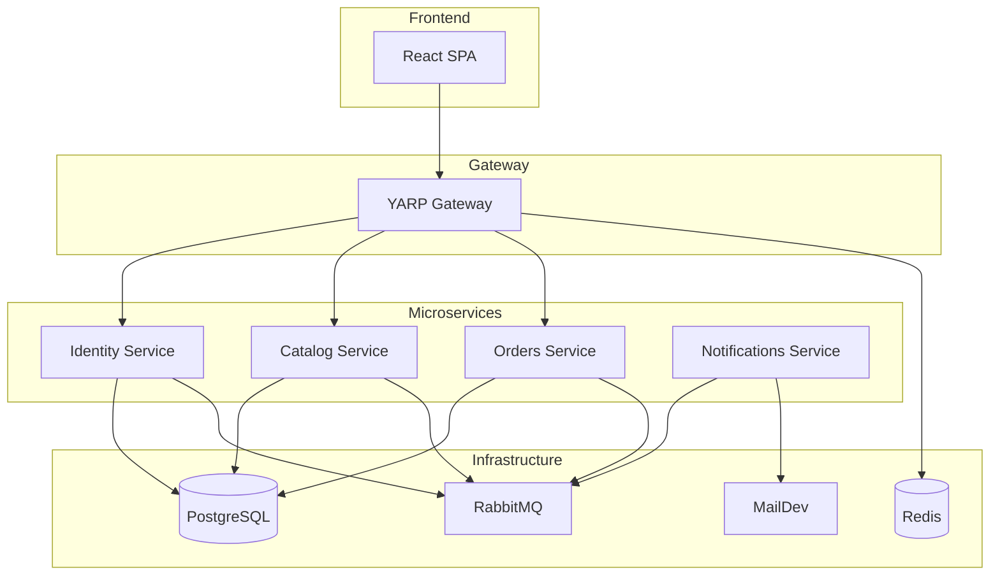

# littleShop 🛒

[](https://dotnet.microsoft.com/)
[](https://reactjs.org/)
[](https://www.typescriptlang.org/)
[](LICENSE)
[](https://www.docker.com/)

**littleShop** es una plataforma de comercio electrónico moderna y distribuida, diseñada bajo una arquitectura de **Microservicios**. Este proyecto sirve como implementación de referencia utilizando tecnologías de última generación del ecosistema Microsoft, incluyendo **.NET 10** y **.NET Aspire**, junto con un frontend reactivo de alto rendimiento.

---

## 📑 Tabla de Contenidos

- [Características Principales](#-características-principales)
- [Stack Tecnológico](#-stack-tecnológico)
- [Arquitectura del Sistema](#-arquitectura-del-sistema)
- [Prerrequisitos](#-prerrequisitos)
- [Quick Start](#-quick-start)
- [Estructura del Proyecto](#-estructura-del-proyecto)
- [Desarrollo](#-desarrollo)
- [Pruebas de Carga](#-pruebas-de-carga)
- [Contribución](#-contribución)
- [Licencia](#-licencia)

---

## 🚀 Características Principales

- ✅ **Arquitectura Desacoplada**: Servicios independientes para Identidad, Catálogo, Pedidos y Notificaciones
- ✅ **Orquestación Nativa**: Gestión completa con **.NET Aspire** para recursos, configuración y entorno local
- ✅ **Frontend Moderno**: SPA construida con **React 18**, **TypeScript** y **Vite**
- ✅ **Comunicación Asíncrona**: Mensajería basada en eventos usando **RabbitMQ** y **MassTransit**
- ✅ **API Gateway**: **YARP** como punto de entrada único y balanceo de carga
- ✅ **Documentación API**: Integración con **Scalar** para una experiencia superior a Swagger
- ✅ **Pruebas de Rendimiento**: Scripts de carga incluidos con **k6**
- ✅ **Infraestructura Local**: Contenedores auto-gestionados para Postgres, Redis y MailDev
- ✅ **Observabilidad**: Telemetría completa con **OpenTelemetry**

---

## 🛠 Stack Tecnológico

### Backend & Cloud Native

| Tecnología | Uso |
|-----------|-----|
| **.NET 10** | Framework principal (C#) |
| **.NET Aspire** | Orquestación y gestión de servicios |
| **PostgreSQL** | Base de datos relacional |
| **Entity Framework Core 10** | ORM para acceso a datos |
| **Redis** | Caché distribuida |
| **RabbitMQ** | Message broker para eventos |
| **MassTransit** | Abstracción para mensajería |
| **YARP** | API Gateway / Reverse Proxy |
| **FluentValidation** | Validación de modelos |
| **Scalar / OpenAPI** | Documentación de APIs |
| **OpenTelemetry** | Observabilidad y telemetría |

### Frontend

| Tecnología | Uso |
|-----------|-----|
| **React 18** | Librería UI |
| **TypeScript** | Tipado estático |
| **Vite** | Build tool y dev server |
| **React Bootstrap** | Componentes UI |
| **Bootstrap 5** | Framework CSS |
| **React Router DOM** | Enrutamiento SPA |

### Herramientas de Desarrollo

- **MailDev** - Servidor SMTP de prueba (Dashboard en puerto 1080)
- **pgAdmin** - Interfaz gráfica para PostgreSQL
- **Redis Insight** - Gestión visual de Redis
- **k6** - Pruebas de carga y rendimiento

---

## 🏗 Arquitectura del Sistema



### Servicios y Responsabilidades

| Servicio | Responsabilidad | Puerto | Dependencias |
|----------|----------------|--------|--------------|
| **littleshop.frontend** | Interfaz de usuario (SPA) | - | API Gateway |
| **littleshop.apiGateway** | Enrutamiento y unificación de APIs | - | Redis |
| **littleshop.identity** | Autenticación JWT, Usuarios y Roles | - | Postgres, RabbitMQ |
| **littleshop.catalog** | Gestión de productos e inventario | - | Postgres, RabbitMQ |
| **littleshop.orders** | Procesamiento de pedidos | - | Postgres, RabbitMQ, Catalog |
| **littleshop.notifications** | Envío de correos y alertas | - | RabbitMQ, MailDev |

> **Nota**: Los puertos se asignan dinámicamente por .NET Aspire. Consúltalos en el Dashboard.

---

## 📋 Prerrequisitos

Asegúrate de tener instalado:

1. **[.NET 10 SDK](https://dotnet.microsoft.com/download/dotnet/10.0)** (Versión más reciente)
2. **[Docker Desktop](https://www.docker.com/products/docker-desktop)** (Debe estar ejecutándose)
3. **[Node.js](https://nodejs.org/)** v18 o superior
4. **Visual Studio 2022** (Preview/Latest) o **VS Code** con extensiones de C#
5. _(Opcional)_ **[k6](https://k6.io/docs/get-started/installation/)** para pruebas de carga

### Verificar instalaciones

```bash
dotnet --version  # Debe mostrar 10.x.x
docker --version  # Cualquier versión reciente
node --version    # v18 o superior
```

---

## 🚀 Quick Start

Gracias a **.NET Aspire**, no necesitas configurar cadenas de conexión manuales ni levantar `docker-compose` manualmente.

### 1. Clonar el repositorio

```bash
git clone https://github.com/littlelauritt/littleShop.git
cd littleShop
```

### 2. Ejecutar la solución

#### Opción A: Visual Studio 2022

1. Abre `littleShop.sln`
2. Establece el proyecto **`littleShop`** (AppHost) como *Startup Project*
3. Presiona `F5` o click en **Run**

#### Opción B: Línea de Comandos

```bash
cd littleShop  # Navegar al proyecto AppHost
dotnet run
```

### 3. Acceder al Dashboard de Aspire

- Se abrirá automáticamente el **Dashboard de .NET Aspire** en tu navegador
- Aquí verás:
  - 📊 Estado de todos los servicios
  - 📝 Logs en tiempo real
  - 📈 Métricas y telemetría
  - 🔗 Endpoints de cada servicio

### 4. Acceder a los servicios

| Servicio | Cómo acceder |
|----------|--------------|
| **Frontend** | Busca `littleshop-frontend` en el Dashboard y abre su endpoint |
| **API Docs** | Cada microservicio expone `/scalar/v1` |
| **MailDev** | Busca `maildev` en el Dashboard (puerto 1080 por defecto) |
| **pgAdmin** | Si está configurado, búscalo en el Dashboard |
| **Redis Insight** | Si está configurado, búscalo en el Dashboard |

---

## 📂 Estructura del Proyecto

```
littleShop/
├── 📁 .config/                          # Configuración de herramientas
├── 📁 .github/
│   └── workflows/                       # ⚙️ GitHub Actions CI/CD Pipelines
│       ├── catalog-pipeline.yml         # Pipeline del servicio Catalog
│       ├── identity-pipeline.yml        # Pipeline del servicio Identity
│       └── orders-pipeline.yml          # Pipeline del servicio Orders
├── 📁 littleShop/                       # 🎯 AppHost (Aspire Orchestrator)
├── 📁 littleShop.Shared/                # DTOs y código compartido
├── 📁 littleShop.identity/              # 🔐 Authentication Service
│   ├── Controllers/
│   ├── Models/
│   ├── Services/
│   └── Program.cs
├── 📁 littleShop.catalog/               # 📦 Product/Catalog Service
│   ├── Controllers/
│   ├── Models/
│   ├── Services/
│   └── Program.cs
├── 📁 littleShop.orders/                # 🛒 Order Service
│   ├── Controllers/
│   ├── Models/
│   ├── Services/
│   └── Program.cs
├── 📁 littleShop.notifications/         # 📧 Email Service Worker
│   └── Program.cs
├── 📁 littleshop.apiGateway/            # 🌐 YARP Gateway
│   └── Program.cs
├── 📁 littleshop.frontend/              # ⚛️ React + Vite App
│   ├── src/
│   ├── public/
│   ├── package.json
│   └── vite.config.ts
├── 📁 littleshop.serviceDefaults/       # Configuración base (Telemetry, Health)
├── 📁 tests/                            # Test projects
│   ├── littleShop.catalog.Tests/
│   ├── littleShop.identity.Tests/
│   └── littleShop.orders.Tests/
├── 📄 load-test.js                      # k6 load testing script
├── 📄 docker-compose.yml                # Configuración Docker (opcional)
├── 📄 Directory.Packages.props          # Gestión centralizada de NuGet
├── 📄 littleShop.sln                    # Solución principal
└── 📄 README.md                         # Este archivo
```

---

## 🔄 CI/CD y GitHub Actions

El proyecto incluye pipelines automatizados de CI/CD configurados en `.github/workflows/` para cada microservicio.

### Workflows Disponibles

Cada microservicio tiene su propio pipeline de CI/CD:

#### 📦 Catalog Pipeline
**Archivo**: `catalog-pipeline.yml`
- Pipeline automatizado para el servicio de catálogo
- Build, test y deployment del servicio de productos

#### 🔐 Identity Pipeline
**Archivo**: `identity-pipeline.yml`
- Pipeline automatizado para el servicio de identidad
- Build, test y deployment del servicio de autenticación

#### 🛒 Orders Pipeline
**Archivo**: `orders-pipeline.yml`
- Pipeline automatizado para el servicio de pedidos
- Build, test y deployment del servicio de órdenes

### Badges de Estado

Añade estos badges al principio del README para mostrar el estado de los workflows:

```markdown
[](https://github.com/littlelauritt/littleShop/actions/workflows/catalog-pipeline.yml)
[](https://github.com/littlelauritt/littleShop/actions/workflows/identity-pipeline.yml)
[](https://github.com/littlelauritt/littleShop/actions/workflows/orders-pipeline.yml)
```

### Ver Estado de los Workflows

Puedes ver el estado y logs de los workflows en:
```
https://github.com/littlelauritt/littleShop/actions
```

---

## 💻 Desarrollo

### Ejecutar tests

```bash
# Ejecutar todos los tests
dotnet test

# Ejecutar tests de un proyecto específico
dotnet test littleShop.catalog.Tests/
```

### Trabajar con el Frontend

```bash
cd littleshop.frontend

# Instalar dependencias
npm install

# Ejecutar en modo desarrollo (standalone)
npm run dev

# Build para producción
npm run build
```

### Variables de Entorno

.NET Aspire gestiona automáticamente las variables de entorno. Sin embargo, puedes personalizarlas en:

- `littleShop/appsettings.json` (AppHost)
- Cada proyecto tiene su propio `appsettings.json`

### Regenerar Migraciones de Base de Datos

```bash
# Ejemplo para Identity Service
cd littleShop.identity
dotnet ef migrations add NombreMigracion
dotnet ef database update
```

---

## 📉 Pruebas de Carga

El proyecto incluye un script de k6 (`load-test.js`) para simular tráfico y verificar estabilidad bajo carga.

### Requisitos

```bash
# Instalar k6
# macOS
brew install k6

# Windows
choco install k6

# Linux
sudo apt-key adv --keyserver hkp://keyserver.ubuntu.com:80 --recv-keys C5AD17C747E3415A3642D57D77C6C491D6AC1D69
echo "deb https://dl.k6.io/deb stable main" | sudo tee /etc/apt/sources.list.d/k6.list
sudo apt-get update
sudo apt-get install k6
```

### Ejecutar tests de carga

```bash
# Asegúrate de que la aplicación esté corriendo primero
k6 run load-test.js

# Con opciones personalizadas
k6 run --vus 10 --duration 30s load-test.js
```

### Interpretar resultados

k6 mostrará métricas como:
- **http_req_duration**: Tiempo de respuesta
- **http_req_failed**: Porcentaje de errores
- **http_reqs**: Requests por segundo
- **data_received/sent**: Throughput

---

## 🤝 Contribución

¡Las contribuciones son bienvenidas! Aquí hay algunas maneras de contribuir:

### Proceso de Contribución

1. **Fork** el proyecto
2. Crea una rama para tu feature:
   ```bash
   git checkout -b feature/AmazingFeature
   ```
3. Haz commit de tus cambios:
   ```bash
   git commit -m 'Add some AmazingFeature'
   ```
4. Push a la rama:
   ```bash
   git push origin feature/AmazingFeature
   ```
5. Abre un **Pull Request**

### Guías de Contribución

- Sigue las convenciones de código del proyecto
- Añade tests para nuevas funcionalidades
- Actualiza la documentación si es necesario
- Asegúrate de que todos los tests pasen antes de enviar el PR

### Reportar Bugs

Abre un issue en GitHub incluyendo:
- Descripción clara del problema
- Pasos para reproducir
- Comportamiento esperado vs. actual
- Screenshots (si aplica)
- Versión de .NET, Docker, etc.

---

## 📝 Roadmap

- [ ] Implementar autenticación OAuth2/OIDC
- [ ] Añadir servicio de pagos (Stripe/PayPal)
- [ ] Implementar carrito de compras persistente
- [ ] Añadir soporte para múltiples idiomas (i18n)
- [ ] Dashboard de administración
- [ ] Sistema de reviews y ratings
- [ ] Notificaciones push en tiempo real
- [ ] Integración con servicios de envío
- [ ] Sistema de descuentos y promociones
- [ ] Analytics y reportes avanzados

---

## 📄 Licencia

Este proyecto está bajo la Licencia MIT. Ver el archivo [LICENSE](LICENSE) para más detalles.

---

## 👤 Autor

**littlelauritt**

- GitHub: [@littlelauritt](https://github.com/littlelauritt)
- Proyecto: [littleShop](https://github.com/littlelauritt/littleShop)

---

## 🙏 Agradecimientos

- Equipo de .NET por .NET Aspire
- Comunidad de React y TypeScript
- Todos los contribuidores de las librerías open source utilizadas

---

**⭐ Si este proyecto te resulta útil, considera darle una estrella en GitHub ⭐**

Hecho con ❤️ por littlelauritt

